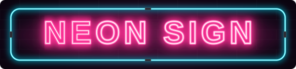

# GitHubプロフィール用 アニメーションSVGバッジ集

日本語 | [English](./README.md)

GitHubプロフィールREADMEにそのまま使える、軽量・依存ゼロのアニメーションSVGバッジ集です。
SVG + CSS/SMILだけで動きます。外部サーバー、画像、JavaScriptは不要です。

---

## 🖼️ ギャラリー

### 💥 爆発 — `explosion.svg`


### 👾 サイバーパンク・グリッチ — `glitch.svg`
テキストが左右にジャキジャキ切り替わり、赤とシアンのRGBスプリットと走査線(レーザー)が走る近未来デザインです。



### 🌃 ネオンサイン — `neon.svg`
白熱コア、周囲のぼんやりした光、不揃いなフリッカーで、夜の街のネオン管を再現しました。



---

## ✨ 特徴

- 🚀 **外部依存ゼロ**: インラインSVGのみ。外部サーバー停止の心配がありません。
- 🎞️ **GitHubの``で動く**: READMEの中でアニメーションが再生されます。
- 🎨 **カスタマイズ簡単**: SVGファイル内でテキストや色を直接変更できます。

---

## 🚀 使い方

### 1. SVGをダウンロード

好きなバッジをこのリポジトリから取得し、自分のプロフィールリポジトリ(`your-username/your-username`)にアップロードします。

### 2. README.mdに追加

```html
<div align="center">
  
</div>
```

`glitch.svg` の部分を `neon.svg` や `explosion.svg` に変えれば、他のバッジも使えます。

> ⚠️ SVGのコードをREADMEに直接貼っても動きません。必ず `` か `` で読み込んでください。

---

## 🎨 カスタマイズ

### テキストを変更する

| ファイル | 編集する場所 |
| --- | --- |
| `glitch.svg` | `<defs>` 内の `<text id="t">`(初期値: `CYBER GLITCH`) |
| `neon.svg` | `<defs>` 内の `<text id="t">`(初期値: `NEON SIGN`) |
| `explosion.svg` | 下の方にある `<text>` タグの `YOUR_NAME` を書き換え |

文字が長い場合は、同じ `<text>` の `font-size` を小さくしてください。

### 色を変更する

**glitch.svg**
- 赤レイヤー: `#ff1744`
- シアンレイヤー / レーザー: `#00e5ff`, `#9ffcff`
- 背景: `#14052b`, `#05010d`

**neon.svg**
- 文字のネオン: `#ff2e93`, `#ff4fa8`, `#ff7cc0`
- 枠: `#00e5ff`, `#33ecff`
- 背景: `#1b0a24`, `#07030b`

`neon.svg` でテキストを変えた場合は、「調子の悪い部分」が狙った文字に当たるよう、`<clipPath id="partClip">` の `x` と `width` も調整してください。

### アニメーション速度を変える

`<style>` 内の秒数(`2.4s`、`5.3s` など)を編集します。切りの悪い数字にすると、より自然な不規則さになります。

---

## 📝 注意

- フォントは閲覧者のOSのシステムフォントに依存するため、文字幅が少し変わることがあります。
- 閲覧者のOSで「視差効果を減らす」が有効な場合、アニメーションが抑えられることがあります。

---

## ⭐️ サポート

役に立ったら、このリポジトリに **Star** ⭐️ をいただけると嬉しいです!